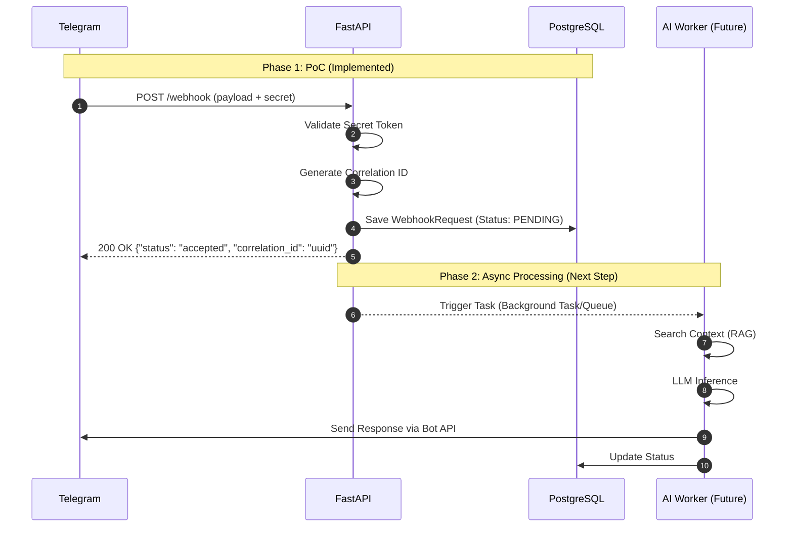

# Webhook-to-AI Agent Microservice

The service accepts webhooks (currently Telegram; if more messengers to be added, abstract Application class with handlers for other messengers should be implemented) and is intended to forward them to an AI agent. The PoC implements receiving webhooks, secret validation, and persistence; the queue and LLM call are described in the architecture.

---

## 1. Architecture (assignment items 1–3)

**Design:** A fast path (webhook → validate → persist → 200) and a slow path (queue → worker → LLM → response). The gateway returns 200 quickly; heavy work runs in a worker.

_Fast path examples:_ Secret validation, correlation_id generation, writing one row to the DB, returning 200 - all within tens of milliseconds.

*Slow path examples:* Context search in the DB (RAG), LLM call, sending reply to Telegram, updating status.

**Components:** FastAPI gateway, Redis (idempotency, cache, queue), PostgreSQL (history, analytics, and pgvector for RAG), worker with AI logic (see below), Telegram and OpenAI APIs.

**Database:** PostgreSQL + pgvector for relational data and embeddings (e.g. Vector(1536)).

**Queues:** Redis-backed, Celery. Used so the webhook response stays fast and failed tasks can be retried.

**Protocols:** HTTP/HTTPS for webhooks (Telegram calls our URL) and for external APIs (OpenAI, Telegram Bot API).

---

## 2. Request flow (assignment item 2)



---

## 3. What is implemented

1. **POST /api/v1/webhooks/telegram** - Accepts JSON (Telegram update format) and header `X-Telegram-Bot-Api-Secret-Token`.
2. The endpoint delegates to `WebhookService` (DI).
3. The service compares the header to `TELEGRAM_WEBHOOK_SECRET`; on mismatch it returns 403. On match: it generates `correlation_id`, writes to table `webhook_requests`, and returns `{"status": "accepted", "correlation_id": "..."}`.

Queues and AI calls are not implemented. The code includes TODOs for idempotency by `update_id` (Redis/DB) and moving processing to a queue for scaling.

---

## 4. Run and test

Requirements: Python 3.10+, PostgreSQL, `.env` (see `.env.example`).

**Local:**

```bash
pip install -r requirements.txt
alembic upgrade head
uvicorn app.main:app --reload
```

**Docker:**

```bash
docker compose up --build -d
```

**1. Test via Swagger (http://localhost:8000/docs):**

1. Open http://localhost:8000/docs.
2. Find **POST /api/v1/webhooks/telegram** and click **Try it out**.
3. In __Parameters__, set header `X-Telegram-Bot-Api-Secret-Token` to the value of `TELEGRAM_WEBHOOK_SECRET` from `.env`.
4. In **Request body**, use JSON such as:

```json
{"update_id": 1, "message": {"message_id": 1, "chat": {"id": 1}, "text": "Hello"}}
```

5. Click __Execute__. Expected: 200 and body `{"status": "accepted", "correlation_id": "..."}`. With wrong or missing secret - 403.

**2. Test via curl:**

```bash
curl -X POST "http://localhost:8000/api/v1/webhooks/telegram" -H "Content-Type: application/json" -H "X-Telegram-Bot-Api-Secret-Token: your_webhook_secret_here" -d "{\"update_id\": 1, \"message\": {\"message_id\": 1, \"chat\": {\"id\": 1}, \"text\": \"Hello\"}}"
```

Expected: 200 and `{"status": "accepted", "correlation_id": "<uuid>"}`. Without the header or with a wrong secret - 403. Table `webhook_requests` should contain one row.

---

## 5. Assignment checklist

| Requirement | Done |
|-------------|------|
| 1. Describe architecture of a service that receives webhooks and forwards them to an AI agent | §1 |
| 2. Diagram of request processing, data storage, and response | §2 (Mermaid) |
| 3. Justify choice of DB, queues, protocols | §1 (Database, Queues, Protocols) |
| 4. PoC on FastAPI: accept POST and log data | POST /api/v1/webhooks/telegram, secret check, DB write, 200 + correlation_id |

---

## 6. Redis
-
In the current PoC, Redis is **not used** in code - only in `docker-compose` and config for the target architecture.

In the described design, Redis is used for: **queue** (fast webhook response and async processing), **idempotency** (avoid processing the same update twice), **context cache** (worker hits PostgreSQL less often). Until the worker and queue exist, Redis can be removed from `docker-compose` or kept for consistency with the description.

---

## 7. Next steps (scaling)

TODOs in the code:

- __Idempotency:__ Check `update_id` (Telegram) in Redis or DB before creating a record; on duplicate webhook return the existing `correlation_id` and do not insert again into `webhook_requests`.
- **Queue:** Instead of writing to the DB in the handler, enqueue a task to Redis/Celery and return 200; the worker persists and processes - less load on the gateway and room for horizontal scaling.
